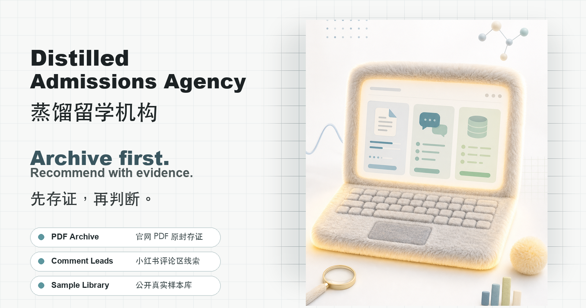

# Promotion Kit / 宣传素材

## Repository Description

```text
A Codex skill that distills study-abroad agency workflows into evidence-backed admissions research, official webpage PDF archiving, public case mining, and reach/main/safety planning.
```

## Visual Assets



Use `assets/social-preview.png` as the GitHub Social preview image. The visual system is a plush research-computer product visual with minimal product-cut pages and muted scientific colors.

- `assets/social-preview.png`: GitHub/social preview image
- `assets/feature-pdf-archive.png`: official PDF archive feature cut
- `assets/feature-xhs-comments.png`: Xiaohongshu public comment leads feature cut
- `assets/feature-sample-library.png`: public sample library feature cut

## Short Taglines

English:

```text
Evidence-backed admissions research, distilled from study-abroad agency workflows.
```

```text
Archive first. Recommend with evidence.
```

```text
Turn official PDFs, public samples, and Xiaohongshu comment leads into a traceable application strategy.
```

中文：

```text
把留学机构的选校逻辑，蒸馏成可验证的本地 AI 工作流。
```

```text
先存证，再判断。
```

```text
官网 PDF 原封存证，小红书评论区线索入库，公开样本还原真实申请生态。
```

## GitHub Topics

```text
codex-skill
admissions
graduate-admissions
study-abroad
school-selection
admissions-research
web-archiving
pdf-archive
public-case-mining
ocr
crawler
firecrawl
playwright
xiaohongshu
ai-agent
education
```

## Launch Post: Chinese

```text
我做了一个 Codex Skill：蒸馏留学机构。

它不是普通的“帮我推荐学校”提示词，而是把留学机构真正有价值的流程拆出来：

1. 先通过问答建立申请者画像
2. 根据 GPA、课程、项目、科研、实习和作品集判断硬/软实力
3. 抓学校官网并保存原版 PDF、增强版 PDF、网页原文和校验 JSON，PDF 可以自己打开批注
4. 检索 GradCafe、Yocket、Reddit、知乎、小红书公开评论区、论坛和中介案例
5. 为每个学校和项目建立 route hypothesis
6. 最后输出有证据来源的冲刺、主申、保底矩阵

我最在意的是可验证：每个判断都要能回到官网、公开案例或本地文件，而不是一句“我感觉可以冲”。

项目名：Distilled Admissions Agency / 蒸馏留学机构
```

## Launch Post: English

```text
I built a Codex skill called Distilled Admissions Agency.

It turns study-abroad agency workflows into a local, inspectable admissions research pipeline:

1. Guided applicant intake
2. GPA-aware hard/soft strength profiling
3. Official school webpage archiving as original PDFs, enhanced PDFs, DOM text, and validation JSON
4. Public admit-case mining across structured databases, forums, Xiaohongshu public comment leads, blogs, and agency pages
5. School-specific route hypotheses
6. Evidence-backed reach/main/safety planning

The goal is not to promise admission. The goal is to make every recommendation traceable.
```

## Xiaohongshu / 知乎 Style Intro

```text
我一直觉得留学机构最核心的价值不是“神秘玄学”，而是它们有案例库、知道怎么读学校官网、知道不同学校的偏好，也知道如何包装一个人的申请证据。

所以我做了一个叫“蒸馏留学机构”的 Codex Skill。

它会先问你问题，建立你的申请画像；再去抓学校官网，把官网页面原封不动保存成 PDF，并额外生成一个文字增强版。PDF 可以自己打开批注，后续判断也能回到原文。

第二个亮点是小红书公开评论区。它会把能正常访问到的评论区个人案例线索、公开录取案例和中介样本一起整理成样本库，标注来源和可靠度，尽量还原真实申请生态。

我希望它不是替代思考，而是把申请判断变得更可追踪、更透明。
```

## README Hero Copy

English:

```text
Distill the useful parts of a study-abroad agency into an evidence-backed Codex skill.
```

中文：

```text
把留学中介最有价值的部分，蒸馏成一个可验证、可复用、可本地运行的 Codex Skill。
```

## Caution Copy

English:

```text
This skill does not guarantee admission or calculate exact admission probability. It separates official requirements, public anecdotes, agency signals, and inference so users can inspect the evidence behind each recommendation.
```

中文：

```text
这个 Skill 不保证录取，也不输出精确录取概率。它会把官网要求、公开案例、中介信号和推断判断分开，让用户能看到每个建议背后的证据。
```
