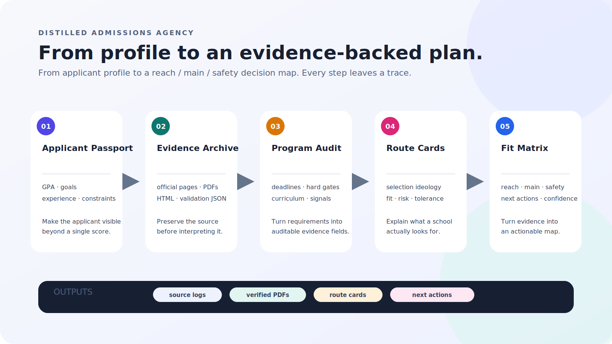

# 蒸馏留学机构

**把留学中介的工作流，蒸馏成一个可验证、可追踪、可本地运行的 Codex Skill。**

蒸馏留学机构不是一个简单的选校推荐器。它更像一个透明的申请研究实验室：先用问答建立申请者画像，再抓取学校官网、存档页面 PDF、整理项目要求、检索公开案例、分析学校路线，最后基于证据输出冲刺、主申、保底策略。



## 三句记住它

- **先存证，再判断。**
- **官网 PDF 原封存证，可打开、可批注、可复核。**
- **小红书评论区线索进入公开真实样本库，不把评论当最终事实。**

## 工作流程

这套 Skill 走一条可追踪的路径：建立申请画像、保存官网证据、审计项目要求、拆解学校路线，最后输出带下一步动作的冲主保矩阵。

主要产物是来源日志、可复核 PDF、学校路线卡和可以继续修改的决策地图。旧的功能插图仍保留在仓库中作为辅助素材，但这张流程图是项目的主叙事。

## 适合谁

- 正在准备研究生申请，希望系统选校的人
- 想用 GPA、项目经历、科研、实习、作品集等综合判断定位的人
- 不想只听模糊建议，想看到来源、文件和证据的人
- 想把留学机构的知识库逻辑做成本地、可复用流程的人
- 需要对学校官网、项目要求、公开案例和中介卖点做系统研究的人

## 它解决什么问题

传统留学咨询里最有价值的部分往往不是一句“能不能冲”，而是：

- 知道怎么问申请者
- 知道怎么读官网
- 知道哪些公开案例有参考价值
- 知道不同学校看重什么证据
- 知道软实力什么时候能补硬分数的风险
- 知道哪些结论只是经验判断，不能当事实

蒸馏留学机构把这些拆成一条可执行流程，并把每一步写成本地文件。

## 核心功能

| 模块 | 产出 |
|---|---|
| 问答式画像 | `passport.yaml`、`profile.md`、硬实力/软实力多维评分 |
| 目标范围 | 地区、学校、专业方向、用户约束、候选学校表 |
| 官网项目库 | 每所学校的项目 catalog、官网来源索引 |
| 官网 PDF 审核 | 原版 PDF、增强版 PDF、HTML、网页原文、PDF 文本、校验 JSON、可批注证据文件 |
| Requirement Audit | 截止日期、GPA、语言、GRE、先修课、作品集、writing sample、课程关键词 |
| 公开真实样本库 | GradCafe、Yocket、Reddit、知乎、小红书公开评论区、论坛、博客、中介案例 |
| 学校路线卡 | 项目偏好、硬门槛、软实力包容度、叙事钩子、风险点 |
| 冲主保矩阵 | 每个项目的 band、硬分风险、软实力补偿、证据强度、下一步动作 |
| 爬虫后端 | Firecrawl、Playwright、小红书链接解析、MediaCrawler 风格研究 |

## 官网 PDF 存证

这个流程会把学校官网页面保存成一组可审计材料：

```bash
python ~/.codex/skills/distilled-admissions-agency/scripts/archive_webpage_pdf.py \
  "<official-url>" \
  --out-dir admissions-db/11_webpage_archive \
  --school "<school-slug>" \
  --program "<program-slug>"
```

它会生成：

- `pdf-original/`：浏览器原样打印的官网 PDF
- `pdf-enhanced/`：文字颜色增强版 PDF，适合阅读和 OCR
- `html/`：页面 HTML
- `text/`：网页 DOM 原文和 PDF 抽取文本
- `validation/`：网页文本与 PDF 文本的匹配校验

原则：原版 PDF 和 DOM 原文是证据，增强版 PDF 只是为了看得更清楚。

## 安装

```bash
python ~/.codex/skills/.system/skill-installer/scripts/install-skill-from-github.py \
  --repo <github-user-or-org>/distilled-admissions-agency \
  --path distilled-admissions-agency
```

安装后重启 Codex。

## 使用方式

```text
使用 $distilled-admissions-agency，先通过问答建立我的申请画像，然后爬学校官网、保存 PDF 存证、分析项目要求和公开案例，最后给我一份有证据来源的冲主保列表。
```

也可以从单个任务开始：

```text
使用 $distilled-admissions-agency，帮我把这几个官网页面存成 PDF，并验证 PDF 文本和网页原文是否一致。
```

```text
使用 $distilled-admissions-agency，帮我分析这些学校的项目路线和 GPA 风险。
```

## 数据边界

- 官网要求优先于任何公开案例。
- 公开案例只能证明“有类似可能”，不能证明录取概率。
- 中介案例是有偏样本，需要标注营销偏差。
- 小红书、知乎、论坛、Reddit 等内容需要隐私脱敏。
- 不绕过登录墙、验证码、付费墙、私密群组或平台限制。
- 用户个人信息不写入可发布的 skill 包，只保存在本地 `admissions-db/`。

## 推荐 GitHub Description

```text
A Codex skill that distills study-abroad agency workflows into evidence-backed admissions research, official webpage PDF archiving, public case mining, and reach/main/safety planning.
```

## License / 许可证

本项目原创的源代码和文档使用 [MIT License](LICENSE)。仓库中的既有视觉素材可能有独立来源，不会因为放在仓库里就自动获得 MIT 授权；使用时请遵守相应创作者的权利和条款。

The original source code and documentation are released under the [MIT License](LICENSE). Existing visual assets may have separate provenance and are not automatically covered by MIT; follow the rights and terms of their respective creators.
